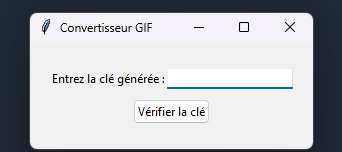
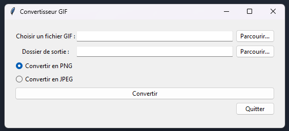

# Convertisseur GIF

## Description
Ce projet propose un convertisseur GIF simple en Python. Il permet de convertir des fichiers GIF en images PNG ou JPEG.

## Conversion en Exécutable
Pour convertir le programme Python en un exécutable, suivez ces étapes :

1. Assurez-vous d'avoir installé PyInstaller en exécutant `pip install pyinstaller` dans votre terminal.
2. Utilisez le script suivant pour générer l'exécutable :


```python
import PyInstaller.__main__

PyInstaller.__main__.run([
 'convertisseur_gif.py',  # Remplacez 'convertisseur_gif.py' par le nom de votre script principal
 '--onefile',  # Génère un seul fichier exécutable
 '--windowed',  # Masque la console lors de l'exécution de l'application
 '--name=Convertisseur_GIF',  # Nom de l'application exécutable
 '--icon=convert.ico',  # Chemin de l'icône de l'application (facultatif)
])
```

## Présentation 



